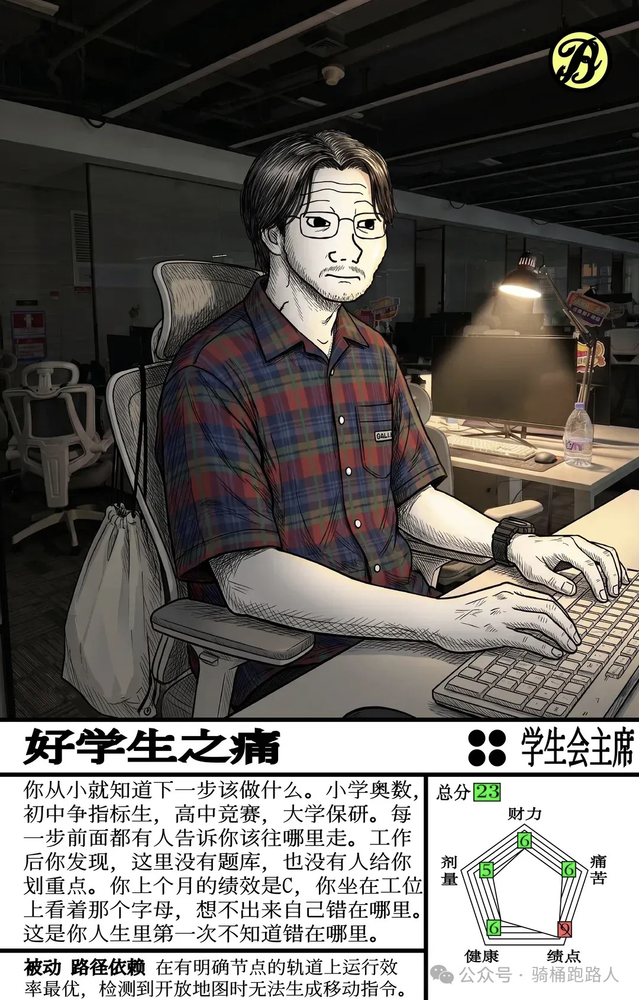
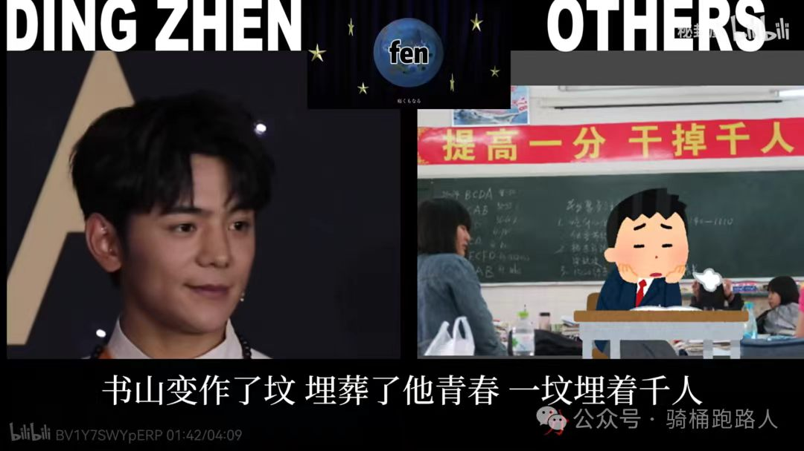
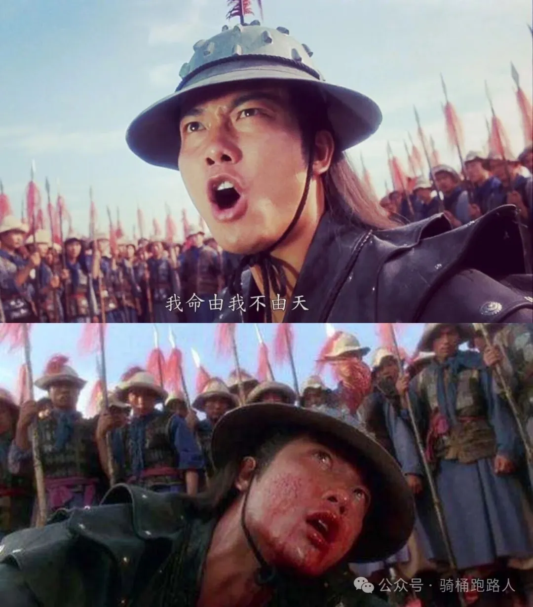
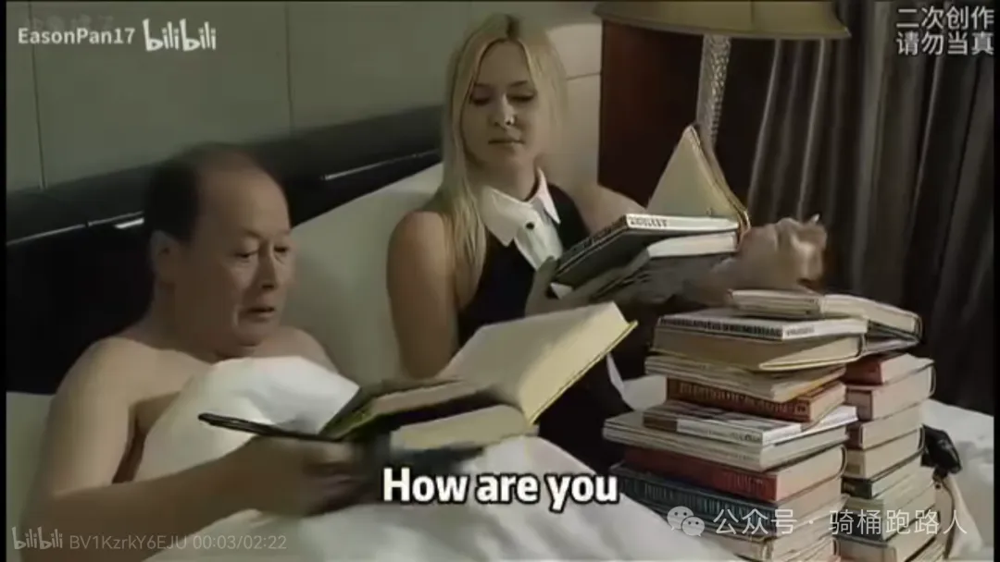
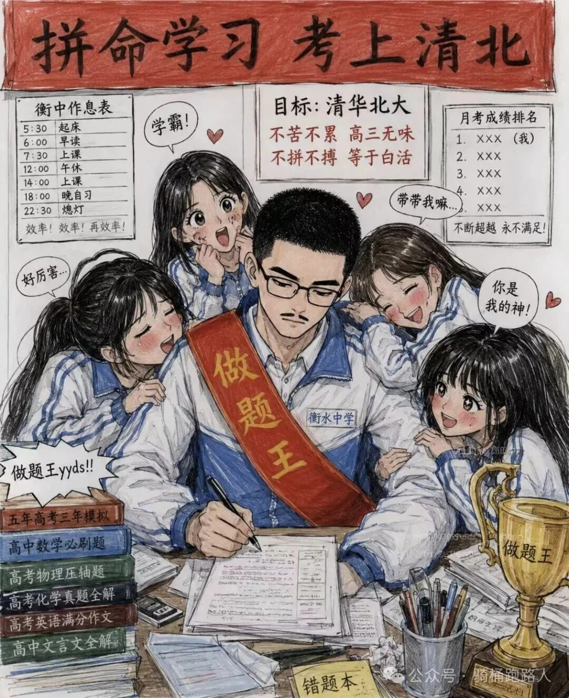
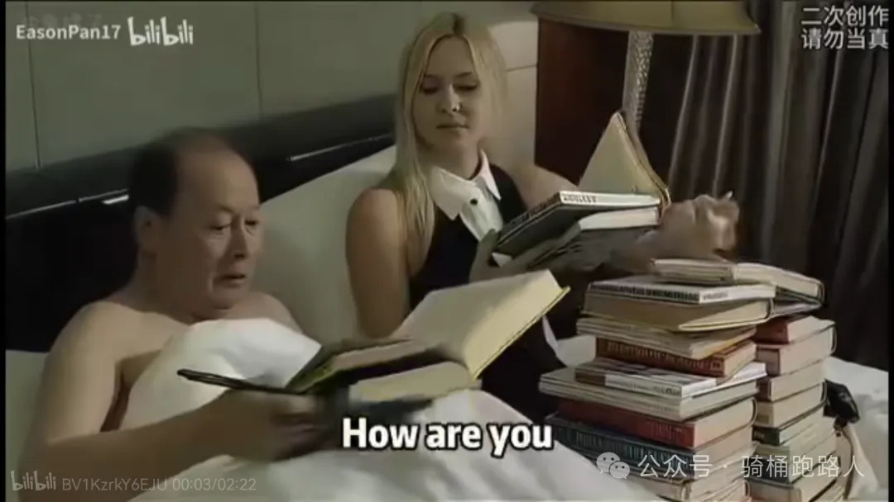
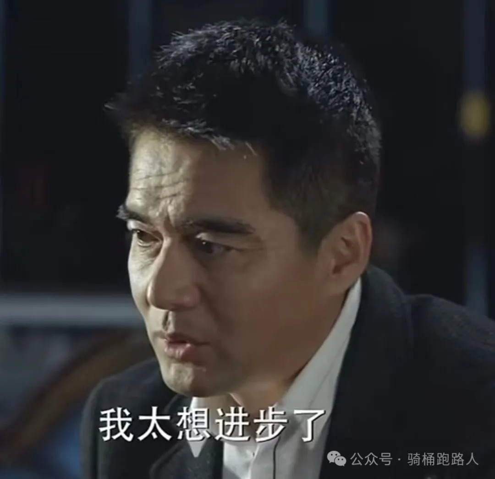

> 本文为微信公众号文章补档，原文发表于微信公众号。
> 原文标题：《刺破高考的面纱：公平幻觉与招笑的"一考定终身"》

高中老师或是出于给学生打鸡血，或是自己也只考过高考，于是真信了，总会对学生们说：“高考是你人生中最公平的考试”

果真如此吗？

用乔治奥威尔《动物农场》里的一句话来说：“所有动物一律平等，有些动物比其他动物更加平等”。

作为一个资深护城河人，我可以很负责任地说，如果把我在护城河考生的比例平移到“城”里，我是妥妥的清华北大。后来我养成了一个好习惯，每次在网上看到有人说“高考筛智商”、“高考是最公平的考试”之类的话，我都会点进他主页看看他是哪里人，根据属地来判断要不要喷他。

这时候又有人要说了，你说高考不公平，你能找到比高考更公平的考试吗？

还是那句话——“所有动物一律平等，有些动物比其他动物更加平等”，从高考大省考生的角度看，考研和考公就是比高考更公平。但如果没经历过地狱模式高考的洗礼，甚至会觉得考研比高考难。考研除了是全国统考之外，哈耶克的大手还拉平了教育资源的差距，大家听的网课都差不多。如果你做过智商测试就会知道，公考行测是最接近智力测试题型的考试。

考研确实有猫腻，但你如果比对手高个十几分，复试表现吊打对方，你就很难被黑掉，毕竟学校也怕舆情。

但同一个大学同一个班里，别说相差十几分，相差几十分都正常。然后你惊奇的发现，虽然你分高，但你是全国一卷，别人虽然分低，但做的卷子还比你简单。

上过高中的都知道，高考越往上越难提分，高考提个十几分，可能比考研提个几十分还要难。我做了好几年考研面试培训了，甚至考研面试的基本盘水平也很低，如果你愿意拿出高考一半的鸡血，遥遥领先对手也很容易。

整天揪着热搜上的个例不放，说考研黑幕多，却对高考这种房间里的大象视而不见，属实令人费解。

但比地域差距更具决定性的，是城乡差距。

我在村里念过三年小学，班主任一人身兼四门老师，英语他实在教不了，就不知道从哪个杂牌子学校调来了杂牌子英语老师，其英语水平未必能高于姜萍的数学水平。我的印象很深刻，我是小学三年级开始学的英语，第一次考了47分，全家人都无语了。英语水平提上来的转折点，是我爹无奈之下开启了中学怀旧服，自学英语然后教我。

所以我一直是全网对姜萍最友善的博主之一，因为我认为，以我国城乡教育资源的不均程度，姜萍的数学水平是绝对有资格当我的小学老师的。

后来到了县里，教育水平有了一个大跃进。即使我们县是全市知名的躺平县，而我们市又是全省知名的躺平市，农村和县城之间的教育水平，依然有一道不可逾越的天堑，二者的鸿沟堪比躺平市和衡水市的区别。我的原生小学同学大都被五五分流了，抛开做题神教最喜欢标榜的智商不谈，他们普遍缺乏一个能自学英语的爹。

现在小镇做题家伤痕文学不少，但你真要细究的话就会发现，小镇做题家往往出身于县城体面人家庭，以师医公国企银行事业编为主，虽然跟富不沾边，但用任何国家的标准来看，都算不上什么穷人。只是在大学里遇到了城市中产出现了心理落差。

再往上倒的话，我爹是纯正的农村做题家，但我爹是有条件脱产读书的，甚至我奶奶愿意供他进行范进式无限复读，只是他自己考了一年就绷不住了。这个条件在村里也不是人人都具备。即使这个仗打得已经比同村小孩富裕了，但我爹依然会吐槽，当年教辅资料稀缺，不像现在教材遍地都是，村里的小孩没有门路搞到教辅，怎么跟县里和城里的小孩斗？

像祁同伟这种纯粹靠基因抽卡考上大学的，我们村确实一个都没有。村里能考上大学的小孩，都有两个特征：一是有条件脱产学习，二是父母有一定教育认知。后者在农村算先进分子了，出于读书无用、重男轻女等思想，不支持孩子上学的有很多。

皮埃尔·布尔迪厄指出：现代教育制度的本质，是通过将社会特权合法化为个人资历，从而使不平等的结构得以再生产。教育回报在很大程度上取决于家庭之前投资的“文化资本”以及继承的社会资本的支持。而中产阶级因为缺乏直接继承的特权，尤其将所有的希望都寄托在“学校市场”的学历转译上，从而产生了特别长期、持续的焦虑与神经质的教育渴望。

海边的西塞罗提了一个词，叫“文化洗钱”，大意是富人通过投资教育，让孩子获得高学历，从而对外表示：你看吧，我不是没文化的大老粗，我孩子也有高学历，我们有钱是因为我们优秀。

然后穷人连忙开始捧臭脚：有钱人不仅比你有钱，还比你努力！

我个人认为“文化洗钱”这个词放在国外比较贴切。在国内，教育其实是中产阶级的再生产，鸡娃最狠的是城市中产，衡水模式的最大基本盘是小地方的中产。

虽然大家都说自己是穷人，但真正的原教旨主义穷人就像我的原生小学同学一样，被五五分流这条河给淹死了。而对于富人来说，学历是个时尚单品，清北复交没那么多美国富人上藤校的灵活门路，如果把孩子搞出身心问题，只是为了个时尚单品，性价比太低了。要是把孩子搞出身心问题，还没搞到时尚单品，性价比就更低了。

从某种意义上讲，衡水模式对街机流动的促进作用，不在于帮助穷人，而在于通过喂史的方式劝退富人。

各地中产考上之后，开始吹“高考是最公平的考试”、“高考筛智商”之类的话术给高考赋魅，从而把自己相对于原教旨主义穷人的优势地位给合理化乃至光辉化了，甚至还有了贬低富人的文化资本——他们都是吃了时代红利和搞关系变现的大老粗，我走到这一步是靠天赋和努力。

至于“一考定终身”，更是扯淡。在我爹那个年代，你说“一考定终身”，我可以选择暂且蒙在鼓里。因为高考成绩确实决定了他是回家种传统庄稼，还是在单位吃铁杆庄稼。学历越高，分配的单位层级就越高。《沧浪之水》里，池大为一毕业就进了省厅，整天在那cosplay屈原，郁郁不得志，但现在省级单位招人很少，这个就业质量完全可以在985开经验分享会了。

但也不是很能完全蒙在鼓里，因为只要眼睛不瞎，就能看出来亲戚朋友里混得最好的并不是会读书的，而是会经商的。当时产能不足，只要能把东西做出来，就能把东西卖出去，随便做点小买卖都能赚个盆满拨盘。很长一段时间里，我家都比那些读书差但做小买卖的亲戚穷多了。人类历史上唯一能“一考定终身”的，大抵是科举罢。

现在的就业形势，读研是刚需，名校学生即使有所谓的能“定终身”的本科学历，但依然在争着保研。不要说一考，两考也定不了终身。

虽然现在都在说第一学历歧视，但你得先是个研究生，并且你的研究生层次要显著高于你的本科层次，才能获得遭遇“第一学历歧视”的资格。如果是法学生，加上法考，这就是三考了。考完再考去个公，这次差不多该定终身了。体制内一旦进去，大概率一辈子不出来了，这会彻底定了。综上，三到四考才能定终身。

如果你高考考得很好，你会发现另一个问题：名校学生的努力程度要显著高于普通学校的学生。被卷抑郁了，心理咨询室都要排队。

如果一考定终身，那这么努力干什么？不能像《沧浪之水》男主一样，等着分配优质工作吗？

于是问题来了，名校学生较高的就业质量，到底是学历带来的，还是他们的努力带来的？你很难说清其中的因果关系。

反正对于我来说，假设让我有我的圈子里中等偏上水平的努力，代价是让我高考少考二十分，我肯定能找到比现在更好的工作。因为败兵必哀，哀兵必胜。

为了救亡图存，我会提升我本就不错的英语水平，并把它打造成一个长板，而不是能看懂个外刊就满意了，甚至学个二外；我会不停地、有目的有规划地找实习，借助高中大学、老师同学一切能借助的人脉关系，而不是去红圈所主要是为了出片来装逼；我会在自媒体上日更，放弃体面与自我表达，疯狂地蹭流量，像个西方政客一样通过发表暴论来洗粉，从而巩固基本盘。

鲁迅说，不满是向上的车轮（《热风·随感录六十一·不满》），仇恨是最具生命力的力量。高考的遗憾是最大的不满，能够绵延数年甚至数十年的。

同一个大学甚至同一个班里，人与人的差距也很大，这就更印证了“一考定终身”这个说法的荒谬性。在现在这个学历贬值，各凭本事的时代更是如此。我见过打着学校法援中心的旗号接私活，本科没毕业就解决了老律师也头疼的案源问题的。虽然他被铁拳砸了，但我相信有这个头脑的人，即使上了大专混得也不会差。

我见过高中用尽了一生的做题力，本科延毕、法考没过，但创业成功财富自由的，我问他好不容易考了个好大学，没走学历变现的道路会不会觉得可惜。他表示我也想走，但我找不到工作。

这事你可能要问了，你举的这些都是个案，普通人高考难道不会一考定终身吗？

还真不会，对于普通人来说，高考也定不了终身。虽然这年头干出点成果非常难，但想要下滑还是非常容易的。选错专业、身心问题、遇到逆天导师、遇到坑b公司，甚至单纯是从小到大一直卷，压力太大，道心破碎了，都可能导致无法实现学历转化为offer的惊险一跃，这时摔坏的不是大学，而是大学生。

所以你会看到名校学生即使学历已经很高了，还在物我两忘地卷，因为高考是真有可能白考。混得不好以至于不想提自己的大学非常正常，无论向上向下，人生都有很多机会，没有一种安稳快乐永远也不差（——谢安琪《喜帖街》）。在人生的长河中，高考只是变量之一，肯定是定不了终身的。

