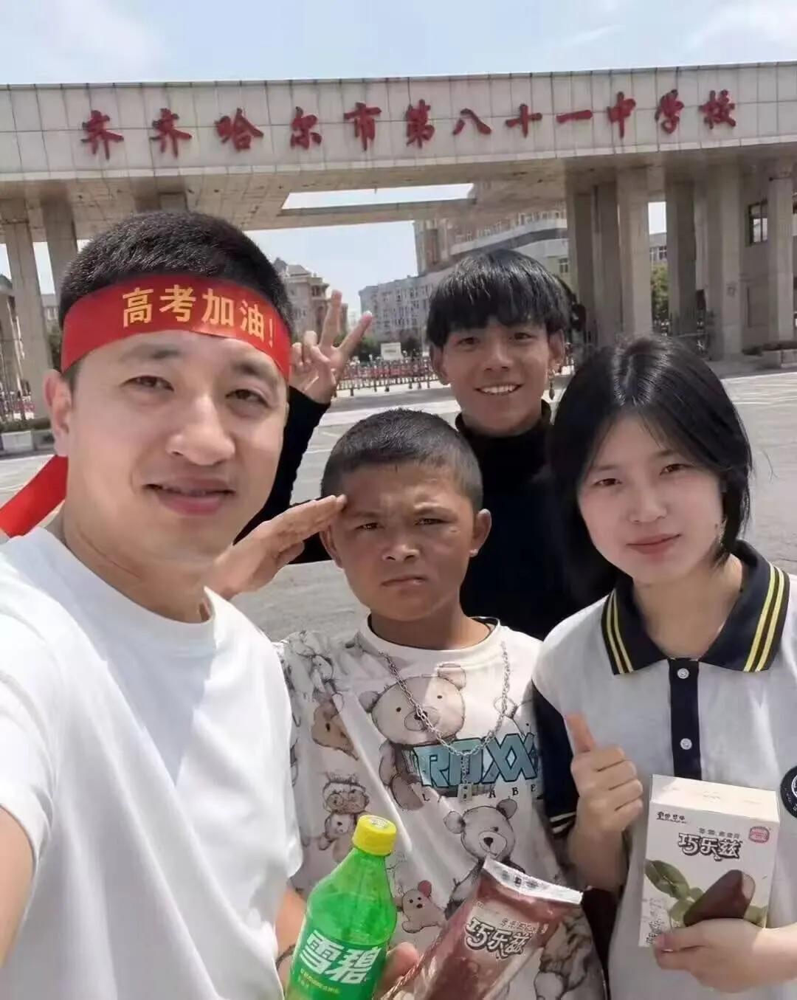
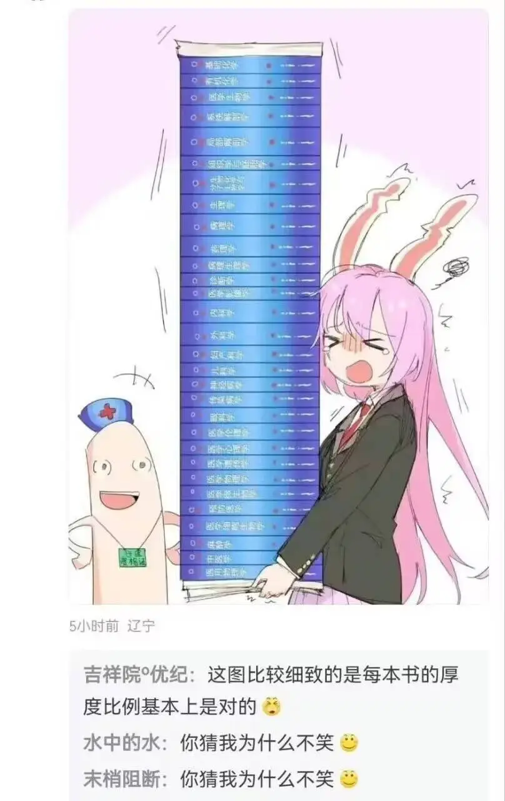

> 本文为微信公众号文章补档，原文发表于 2026 年 6 月 9 日。
> 原文标题：《我高考前在看Mygo》

又到一年高考季，在我的视野里，高考季一年比一年热度低了，高一高二似乎感觉全网都在给高三生加油送行，现在看到高三生更多的是轻松调侃，以前礼仪化的“高考加油”也不怎说了。轻松调侃包括但不限于b站科比牢大穿越到高中的ai视频，张圣帝君的雪碧巧乐兹夏日两件套，更早些的还有丁真，不在话下，于是高考加油变成了下图这样的解构：

我高考前几个月开始看mygo，那时候mygo已经完结了半年，网上冲浪总避不开相关的讨论和梗图，于是抱着品鉴一下的心态前去大调查，结果被这种超越人际关系悖论的成长系剧情感动得一塌糊涂。实现了一朝看go，一辈子也走不出go。后面的时间看二创聊剧情刷梗图都融入了我高考前的日常，同时还在期待着到了大学能爽看ave mujica，最后被拉了坨大的。

要说我高中的压力也不怎么大，高三了也有体育课上，老师也都适当放宽管理生怕你扛不住，唯一受不了的就是作业量巨大，几乎每天都有考试，每天至少有三张卷子要做，一场考试要考。终于从题海熬出来，到了最后这几天就是随缘了，老师把卷子和答案丢给你，说最好还是做做吧。

最搞的是，那段时间和同桌还有周围的几个人，迷上了下象棋。光下中国象棋还不够，还搞来了国际象棋。物理老师路过窗户看到我们桌上摆的东西大跌眼镜，惊呼离高考没一周了你们还有闲心博弈。

其实大部分的高三生得心态，都是离高考越近越松弛淡泊的。这几天上网冲浪就能抓到不少高三生。

前几天写了一篇张老师的文章，狂炫了点流量，结果被大手制裁，阅读量到五千就被卡脖子了。我作为在张老师最火的时间参与高考的一届学生，恰逢高考志愿第一次改革，张老师这个角色，几乎是我们这一届学生家喻户晓的人物。那段时间在唱衰计算机，大模型ai之类还没出圈，更多的是说该行业已经过饱和了，如今吃香的热点是电气工程。

我也不知道这样的节奏从何而起，我们那一年仿佛雨后春笋一样冒出许多志愿填报规划师，我妈是淳朴的劳动人民，整天也替我焦虑。自己还莫名其妙在直播间加上了一个本地的高考规划师，还说有空叫我过去谈谈。稍微一打听价格，志愿填报全套要6000块，我和我妈都挥手作罢。

要说我对高考生们有什么想说的，那就是填志愿要多有一点主见。我妈因为焦虑，把七大姑八大姨聚起来吃顿饭，图的是让他们各人给出点意见。结果是一群老登坐在一起喝高了，让我去学医。兴致到了，还说以后他们看病就来找我，让他们少花些冤枉钱。

我当时也是意气用事，一赌气说学医就学医吧，回去当即把志愿改了。结果是翌日，姨妈赶过来为喝高的姨父提出的馊主意道歉，她回自己科室一问，同事都说现在大学生学医无异于自毁前途，怎么会给我提出这种建议呢？

当天下午志愿填报就要截止了，服务器还有点挤，心慌意乱之下就把自己筛选过后的学校+夸克志愿排出来的给丢上去了。预期是本地老牌211，也就是我许多同学，还有往年的学长，一些亲戚，都走的这条路。

结果是夸克志愿给我也拉了坨大的：夸克志愿显示我分数不及这个学校的某专业，因此成功概率较低，所以排在了前排。我们那届志愿是院校+专业，总共可以填九十多个，加上时间紧任务重，为了赶紧不学医，我也没来得及一个一个家访。后来等录取通知下来人都傻眼了，压根不知道这是什么学校，不是酒吧舞也不是二幺幺，更不是双一流。夸克显示录取概率低，是因为去年这学校的这个专业只在我们省录了两个人，这两人分数差得大，属于是低分捡漏，高分栽坑。

一想到下一年还有后来者也可能会栽进被我抬得虚高的省内分数线，我就想笑。但是这个专业下一年就没在我们省招生了，我已堂堂绝版。当然这个学校也不差，下一年年这学校分数线涨了一波，让我再高考一次未必考得上。

我当时自己筛选的学校，有些个近乎倔强的硬性要求：宿舍一定要上床下桌并且单人单桌，一定不能有早晚自习跑操，最好不要有校园跑。事越少越好。其他什么保研策略通通一眼略过。结果是求仁得仁，这学校把这些条件都满足了，进新生群打听关于保研的事大跌眼镜，压根没有保研名额，连本校研究生招生资格都没发下来。所以几乎没有竞争压力，卷绩点的性价比下降了，学校整体氛围十分闲适，像是托马斯曼笔下的魔山。

进校结识了一群朋友，一起蹲到了ave mujica开播，赤了大半个月赤完后，我顿发觉悟：这部作品实在是烂得可以。mygo已然成为大家心中的白月光，不期待有什么超越，但是也没想到能收获如此纯粹的赤石体验。这部作品的完成是在二创的过程里完成的，每一个奇异搞笑视频，造梗的鬼畜或者评论，都推动了这部动漫成之为现象级。

我最不后悔的事就是mujica是追着看的，而不是像mygo一样屯了大半年再一口气看完。因为追着看其实就是追着骂，大家一起骂，好不痛快！听说27年mujica 2要开播了，编剧还是柿本广大，大家届时一定要参与进来，不要把石堆到一起赤。

回想起来我高考到大学其实就是mygo到mujica的过程，高考前有焦虑，压抑，痛苦。志愿填报赤了大的，但是在这个学校就读的体验又很爽，补完了大学的体验。刚入校时一直在痛苦后悔，纠结于学校的标签，还考虑过复读，但是正如上面所说，这里给我的感觉太像是魔山，就算打算好了离开，自己与这里的联系却越来越深。

相比我高考那年的大焦虑节奏，现在的版本已经到了大摆烂时代：ai平等冲击所有行业，选什么专业都是一样的，不如选自己喜欢的。我不反对也不支持这样的看法，实际上进了大学都多多少少会后悔，我周围的每个人都过这样的想法。我们的时代既可以有为了拼搏压缩自己的张雪峰，也可以有拿一生去赌爱好的张雪，总之是饿不死，大胆去做吧。

最后祝广大学子高考顺遂！
